# Ubiquitous KPZ

---

<video data-autoplay class="stretch" data-src="assets/Supplemental_Video_2.avi"></video>

## The KPZ Equation

$$
\frac{\partial h}{\partial t} = \nu\frac{\partial^2 h}{\partial x^2} + \frac{\lambda}{2}\left(\frac{\partial h}{\partial x}\right)^2 + \xi(x,t)
$$

## Happy Birthday KPZ

---

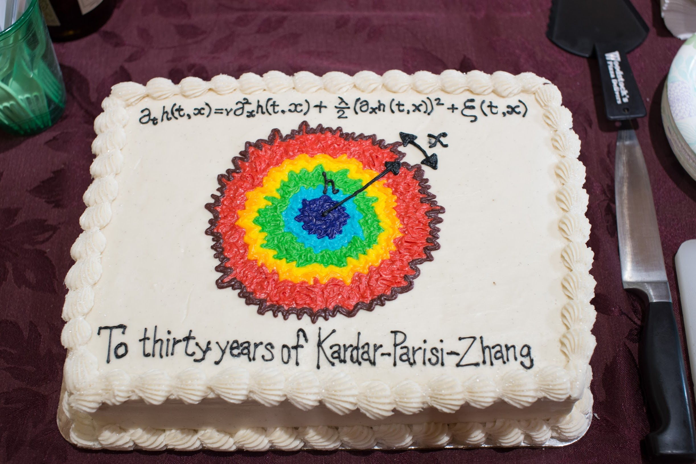

## Growing Interfaces

---

$$
\frac{\partial h}{\partial t} = \nu\frac{\partial^2 h}{\partial x^2} + \frac{\lambda}{2}\left(\frac{\partial h}{\partial x}\right)^2 + \xi(x,t)
$$

- $\nu\partial_x^2 h$ describes __diffusion__.
- $\xi(x,t)$ is __noise__.
- What about $\frac{\lambda}{2}(\partial_x h)^2$? Who ordered that?

## The Nonlinear Term

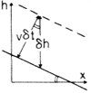

Adding material at rate $v$ to the surface causes it to rise by

$$
v\delta t\sqrt{1+(\partial_x h)^2}
$$

in time $\delta t$

## Experiment

<video data-autoplay class="stretch" src="assets/srep00034-s3.mov"></video>

Turbulent liquid crystals. Takeuchi & Sano, 2010

## Other Systems

- KPZ used to describe bacterial colony growth, flame propagation, etc.

- The physics of each situation seems different.

- What do we mean to say that each is _described_ by KPZ?

# Statistical Physics

## The Big Idea

- How do we understand _macroscopic_ matter in terms of _microscopic_ constituents?

- Talking about a uniform _state of matter_ requires that widely separated regions are nearly independent.

- _Living matter_ is quite different in this respect.

## A Phase Diagram

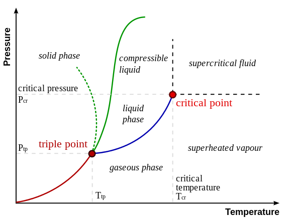  

## Critical Point

  

## Lattice Gas

## Ising Model

$$
H = -J\sum_{\langle j\,k\rangle} \sigma_j \sigma_k + h \sum_j \sigma_j,\qquad \sigma_j = \pm 1
$$

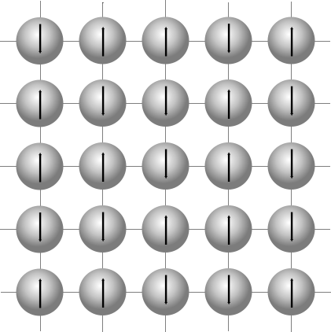

---

---

<video data-autoplay class="stretch" data-src="assets/ising.mp4"></video>

## At Critical Point

- System is __scale invariant__ (a fractal).
- Correlation function is power law
  $$
  \langle \sigma(\mathbf{x})\sigma(\mathbf{y})\rangle = \frac{1}{|\mathbf{x}-\mathbf{y}|^\eta}, \qquad |\mathbf{x}-\mathbf{y}| \to \infty
  $$
- $\eta$ is a __critical exponent__
- Exact solution in 2D: $\eta=1/4$.
- No exact solution in 3D.

---

## Universality

- Ising model is clearly ridiculously oversimplified.
- Why don't we study more complicated models?

---

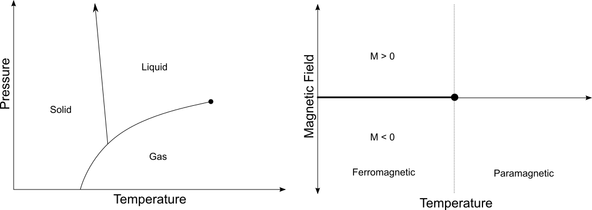

- Near the critical point, the physics is the same!
- More precisely, critical exponents coincide.

## Random Walk

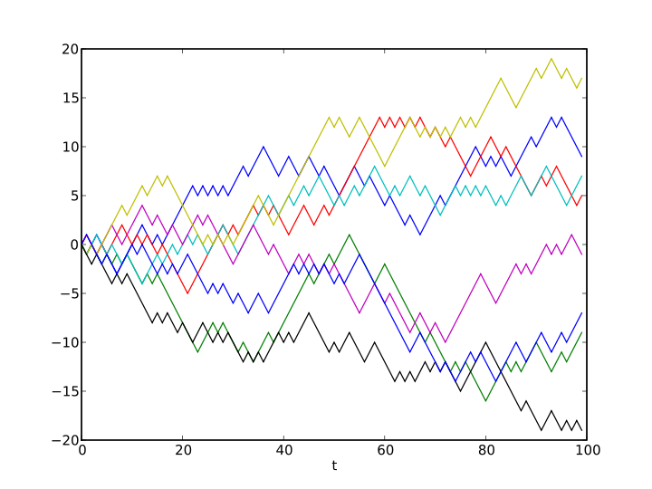

---

## Heat Equation

  $$
  \frac{\partial \phi}{\partial t} = D \frac{\partial^2 \phi}{\partial x^2}
  $$

Equation 'smoothes' $\phi(x,t)$

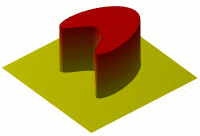

## At Long Times...

$$
\phi(x,t)\longrightarrow \frac{\phi_0}{\sqrt{t}} \exp\left(-\frac{x^2}{4Dt}\right)
$$

...no matter what you start with!

- Shows key property of diffusion that $x\sim \sqrt{t}$
- $T \sim L^z$ with __dynamical critical exponent__ $z=2$.
- This wouldn't be changed if we added terms with more derivatives e.g. $\frac{\partial^4 \phi}{\partial x^4}$.

## Scaling for KPZ

$$
h(x,t) - vt \sim t^{1/3}
$$

- Spatial scale of fluctuations is $L\sim t^{2/3}$, so $z=3/2$
- Different from diffusion, but __universal__.

# More Connections

## Traffic

- From a theorist's viewpoint!
- Particles on sites, one per site.
- Particles hop to right with some rate, if they can.

    

---

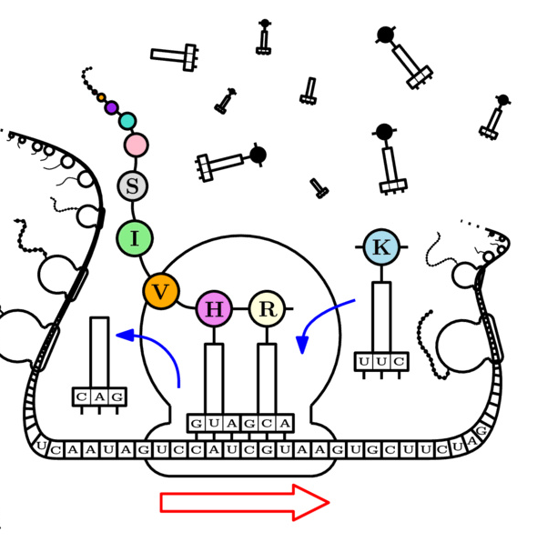

---

From hops to heights...

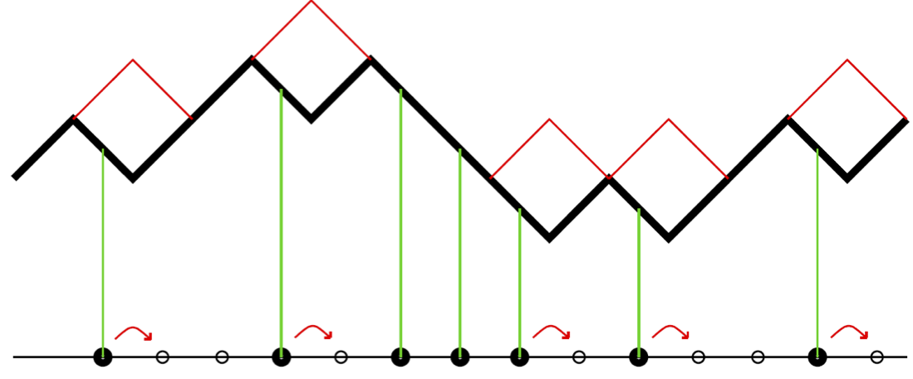

$$
\frac{\partial h}{\partial x} = \frac{1}{2}-\rho
$$

## Hydrodynamics

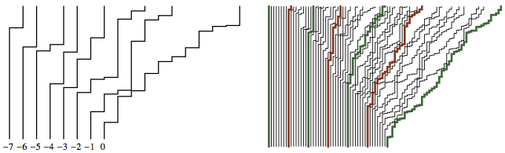

---

Think in terms of local __density__ $\rho(x,t)$ and current $j(x,t)$.

- They obey the __continuity equation__

    $$
    \frac{\partial \rho}{\partial t} = - \frac{\partial j}{\partial x}
    $$

- Velocity $v\propto (1-\rho)$, so

    $$
    j = \rho v = \rho(1-\rho)
    $$

- Putting it together gives __Burgers' equation__

    $$
    \frac{\partial \rho}{\partial t} = - \frac{\partial}{\partial x}\rho(1-\rho)
    $$

---

$$
\frac{\partial \rho}{\partial t} = - \frac{\partial}{\partial x}\rho(1-\rho)
$$

- As we saw, $\rho-\frac{1}{2}=\frac{\partial h}{\partial x}$, so this is

    $$
    \frac{\partial h}{\partial t} = \frac{\partial h}{\partial x} + \left(\frac{\partial h}{\partial x}\right)^2
    $$

- Compare KPZ

    $$
    \frac{\partial h}{\partial t} =  \frac{\lambda}{2}\left(\frac{\partial h}{\partial x}\right)^2 + \nu\frac{\partial^2 h}{\partial x^2} + \xi(x,t)
    $$

- Noise and diffusion are higher order effects

## Polynuclear Growth

---

<video data-autoplay class="stretch" data-src="assets/PNG.mp4"></video>

## Spacetime View

---

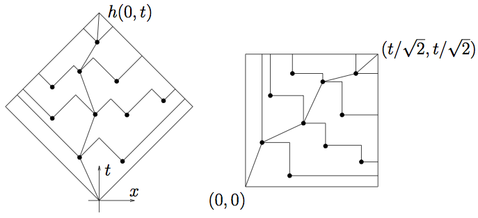

---

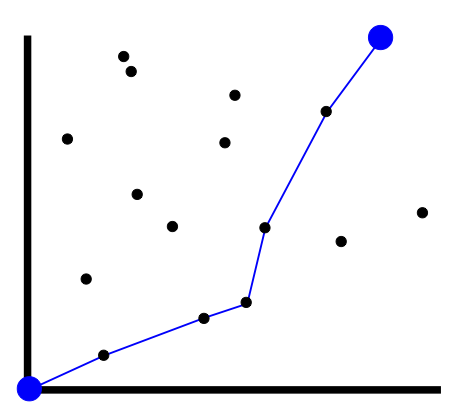

- Polymer is stretched out in $(1,1)$ direction, but attracted to points.

- Wants to maximize number visited, subject to moving up and to the right.

---

This is the __directed polymer in a random potential__. It's equivalent to KPZ!

## Wandering

---

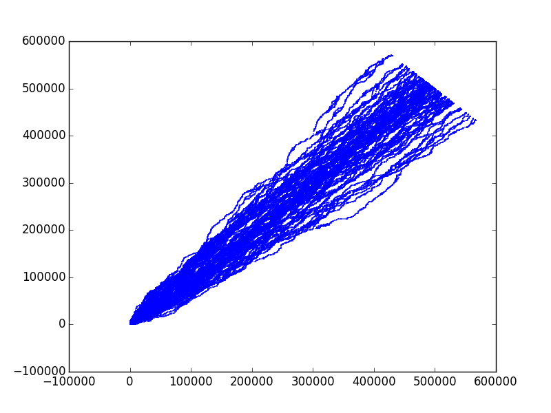

---

Remember $T \sim L^z$. Here $T = x+y$, $L=x-y$, so $z=3/2$

## Geodesics

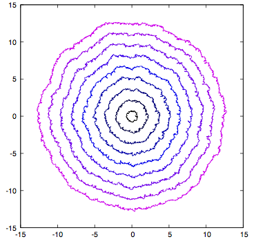

- Model for propagation of light in random refractive index, or fluctuating spacetime geometry.

# Solving the KPZ Equation

## Can We Solve KPZ?

- This means: calculate the statistical properties exactly

- __Nope__

- Actually, it's a struggle to _define_ it!

---

__Martin Hairer__ won the Fields medal in 2014 for giving precise __meaning__ to the KPZ equation.

- Thus we resort to __models__. If we believe that scaling behaviour is insensitive to details of system, we are free to choose!

- Such models have played a __vital role__ in our understanding of critical phenomena.

---

<video data-autoplay class="stretch" data-src="https://physics.aps.org/assets/70895a19-0bf0-42a8-86fb-5255c3647829/video1.mp4"></video>

---

Back to directed polymer

---

Permutation $(23154)$

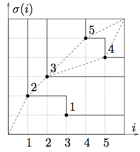

__Longest increasting subsequences__ are $(2,3,5)$  and $(2,3,4)$.

---

The fluctuations of __height__ of a KPZ surface, or of the energy of a __random polymer__, are equivalent to the statistics of the longest increasing subsequence of a __random permutation__!

- Statistical physics reduced to __combinatorics__.

## Effect of Geometry

<video data-autoplay class="stretch" src="assets/srep00034-s3.mov"></video>

---

<video data-autoplay class="stretch" src="assets/srep00034-s2.mov"></video>

---

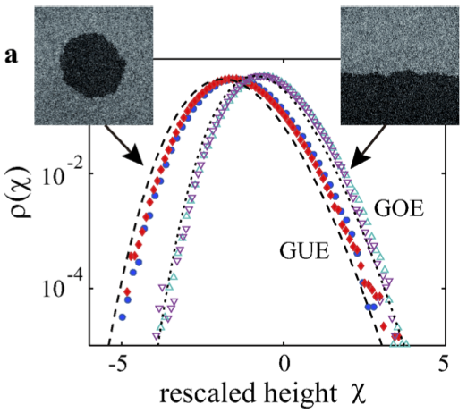

- Exact solution describe different probability distributions.
- Same $h(x,t) - vt \sim t^{1/3}$ scaling.

# What Don't We Know?

---

- Almost anything about higher dimensions (e.g. growth on a 2D interface). Critical exponents and scaling functions.

- A rough-to-smooth phase transition?

- Any generalization of the 'tricks' (e.g. random permutation) used in 1D.
